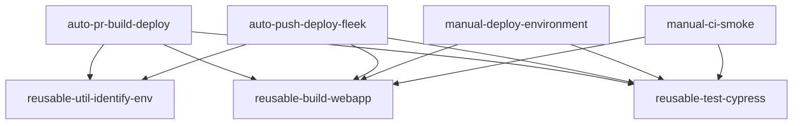

# GitHub Actions Workflows Documentation

## Naming Convention

All workflow files follow a consistent naming pattern:
```
[trigger]-[category]-[action].yml
```

## Workflow Categories

### 🚀 Automatic Workflows (Event-triggered)

| Workflow | File | Trigger | Purpose |
|----------|------|---------|---------|
| Auto: PR Build & Deploy | `auto-pr-build-deploy.yml` | Pull Request | Build, test, and deploy preview for PRs |
| Auto: Push Deploy (Fleek) | `auto-push-deploy-fleek.yml` | Push to develop | Deploy to Fleek hosting |

### 🎮 Manual Workflows (workflow_dispatch)

| Workflow | File | Purpose |
|----------|------|---------|
| Manual: Unit Tests | `manual-test-unit.yml` | Run specific unit tests on demand |
| Manual: CI Smoke | `manual-ci-smoke.yml` | Test CI pipeline connectivity |
| Manual: Deploy to Environment | `manual-deploy-environment.yml` | Deploy to specific environment |
| Manual: Release - Merge to main | `manual-release-merge-main.yml` | Merge approved changes to main branch |
| Manual: Release - Create Tag | `manual-release-tag.yml` | Create version tag for release |

### 🔧 Reusable Workflows (workflow_call)

| Workflow | File | Used By | Purpose |
|----------|------|---------|---------|
| Reusable: Build Webapp | `reusable-build-webapp.yml` | PR/Push workflows | Build web app and Storybook |
| Reusable: Cypress Tests | `reusable-test-cypress.yml` | PR/Push workflows | Run E2E tests |
| Reusable: Util - Identify Env | `reusable-util-identify-env.yml` | Deploy workflows | Determine deployment environment |

## Workflow Dependencies



## Required Secrets

- `PAT` - Personal Access Token for GitHub operations
- `CODECOV_TOKEN` - Code coverage reporting
- `CHROMATIC_PROJECT_TOKEN` - Storybook visual testing
- `ALCHEMY_API_KEY` - Blockchain RPC access
- `AMPLITUDE_API_KEY` - Analytics tracking
- `SQUID_WIDGET_INTEGRATOR_ID` - Cross-chain widget
- `TENDERLY_KEY` - Smart contract debugging
- `CLOUDFLARE_API_TOKEN` - Pages deployment
- `CLOUDFLARE_ACCOUNT_ID` - Cloudflare account
- `FLEEK_TOKEN` - Fleek deployment
- `FLEEK_PROJECT_ID` - Fleek project

## Required Variables

- `SF_ENV` - Secured Finance environment
- `USE_PACKAGE_VERSION` - Package version flag
- `SUPPORTED_CHAIN_IDS` - Supported blockchain networks
- `GRAPHQL_SERVER_URL` - GraphQL endpoint
- `SUBGRAPH_URL_*` - Subgraph endpoints per chain

## Testing Workflows

### Test a manual workflow
```bash
gh workflow run manual-test-unit.yml --ref <branch>
gh run list --workflow=manual-test-unit.yml
```

### Monitor workflow execution
```bash
gh run watch <run-id>
gh run view <run-id> --web
```

### Check PR status
```bash
gh pr checks <pr-number>
```

## Troubleshooting

### Common Issues

1. **startup_failure**: Check if required environment exists
2. **Missing secrets**: Verify all required secrets are configured
3. **Permission denied**: Check PAT token permissions

### Debug Commands

```bash
# List all workflows
gh workflow list

# View workflow runs
gh run list --limit 10

# Get workflow details
gh api repos/:owner/:repo/actions/workflows
```

## Maintenance

When adding new workflows:
1. Follow the naming convention
2. Add unique display name with appropriate prefix
3. Document in this README
4. Test on feature branch before merging

Last updated: 2025-08-14